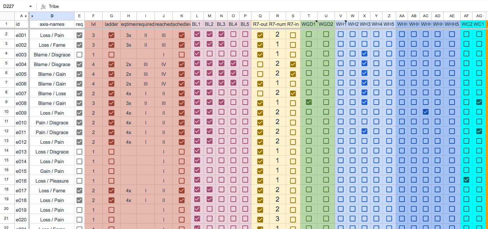

# EQueueSim
This is the simulator-code running on GoogleSheets Apps-script for my upcoming boardgame EQueue (offline game)

This project is tied quite deeply into the GoogleSheet where I keep all my card-parameters for over 200 cards and action-tiles.
I will soon also create a simple dummy-sheet to show how it is used to calculate all possibilities, strength curves of each item, etc.

At the moment, these graphs/value-sets are calculated trough GoogleSheets own functions:

Following my gameplay rules, the simulator takes random sets of cards from the sheet, calculates their parameters, simulates 
the hexagonal action-tiles placements (within memory) and depending on players choices, takes action, plays cards, takes 
income etc.

### Some notes on the sheet requirements and its connection to Photoshop

The sheet itself is optimized for producing the cards automatically trough data import via CSV files. Thus, the organization of the variables is heavily bound to the variables within Photoshop. Even though, it does a heavy task for mankind, it is important to feed Photoshop with the right columnar-view and also post-edit the CSV-file trough a text-editor. Especially filling in ,'', values where only ,, is present is quite important. Photoshop sucks at giving correct error-phrases, so it is pretty a long trial-error fight until I could produce all 200 cards. Even then, I found out that some layers were not toggled as supposed they should do, resulting with 10-20 wrongly colored cards within the deck.

## How to replicate

The order of the scripts is important within GoogleApps Script dashboard. This is the order I've used:
- BinaryHeap.gs
- BHex.gs
- BHex-patch.gs
- game.gs
- menu.gs

I of course added GoogleSheets service into Services.

Also please note that I've used lodash (LodashGS v6) which can be installed into libraries:

Adding the library to your project

Lodash for Google Apps Script is made available as a script library. This is how you add it to your project:

    Select "Resources" > "Libraries..." in the Google Apps Script editor.
    Enter the project key (1SQ0PlSMwndIuOAgtVJdjxsuXueECtY9OGejVDS37ckSVbMll73EXf2PW) in the "Find a Library" field, and choose "Select". (If you have copied the library, enter instead the project key of your copy.)
    Select the highest version number, and choose Lodash as the identifier. (Do not turn on Development Mode unless you know what you are doing. The development version may not work.)
    Press Save. You can now use the Lodash library in your code.
